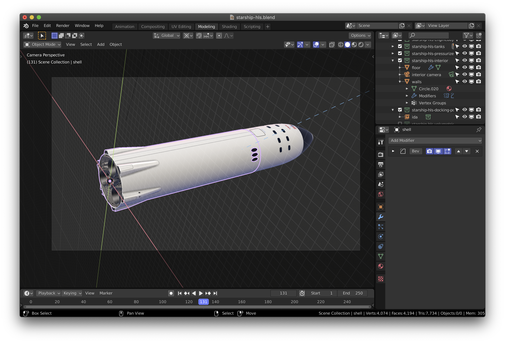
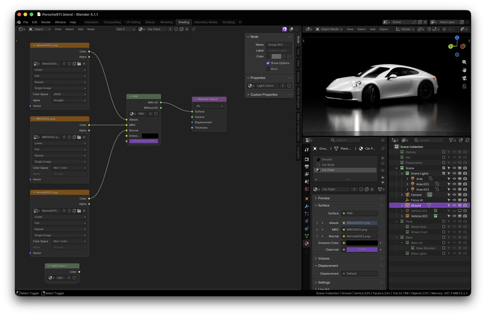
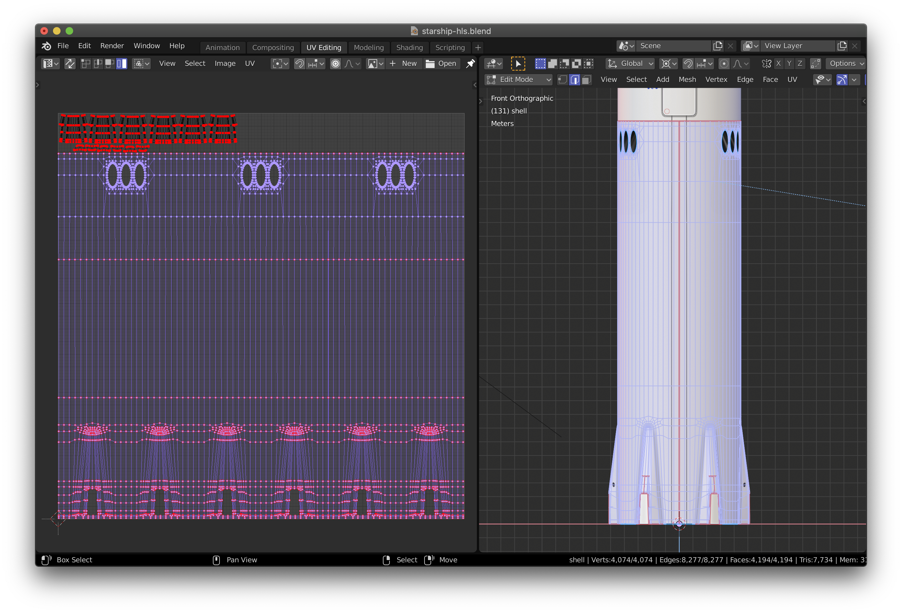

# Blender Royal

A dark, minimal theme for Blender 5.1+

## Royal Dark

[**Download `Royal_Dark.xml`**](https://raw.githubusercontent.com/ForestKatsch/BlenderRoyal/master/themes/Royal_Dark.xml)

1. Open Blender and go to **Edit / Preferences**
2. Select the **Themes** tab
3. Click **Install** and select the XML file you downloaded

# License

This project is made available under your choice of these terms:

* Public domain
* CC0 1.0
* [WTFPL](https://www.wtfpl.net/)
