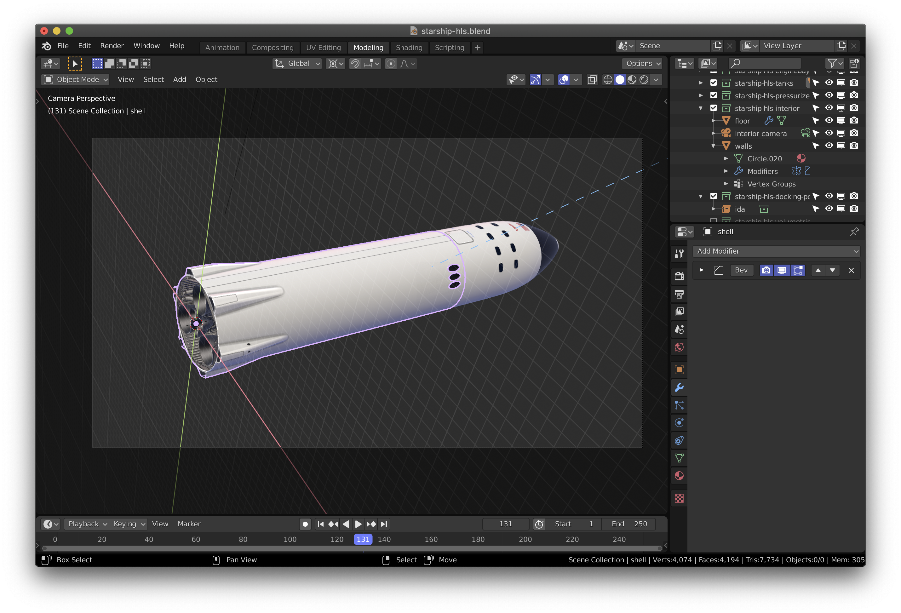
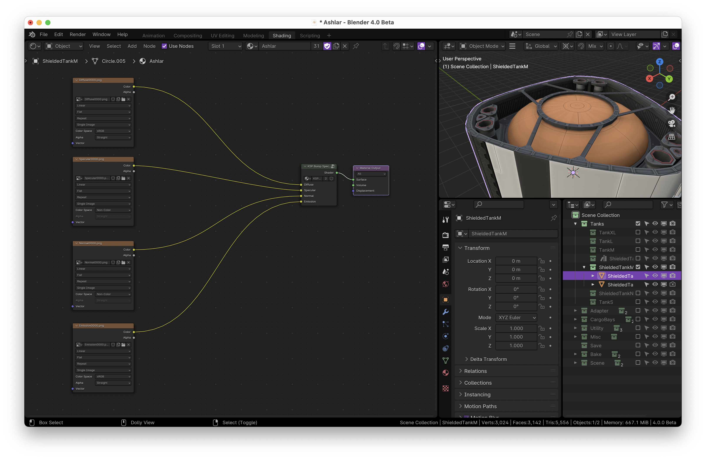

# Blender Royal

A dark, minimal theme for Blender 4.0

## Royal Dark

[**Download `Royal_Dark.xml`**](https://raw.githubusercontent.com/ForestKatsch/BlenderRoyal/master/themes/Royal_Dark.xml)

1. Open Blender and go to **Edit / Preferences**
2. Select the **Themes** tab
3. Click **Install** and select the file you downloaded

